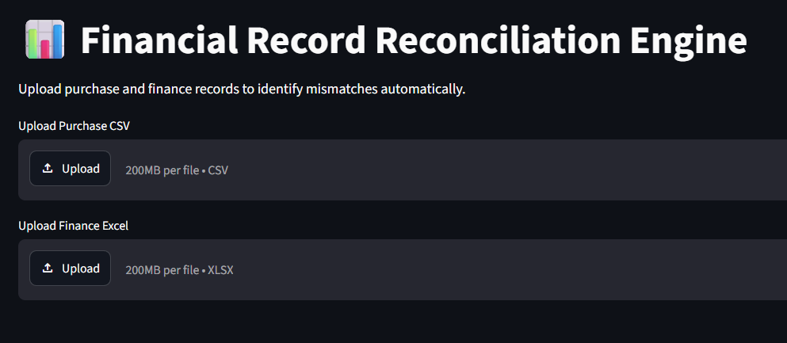
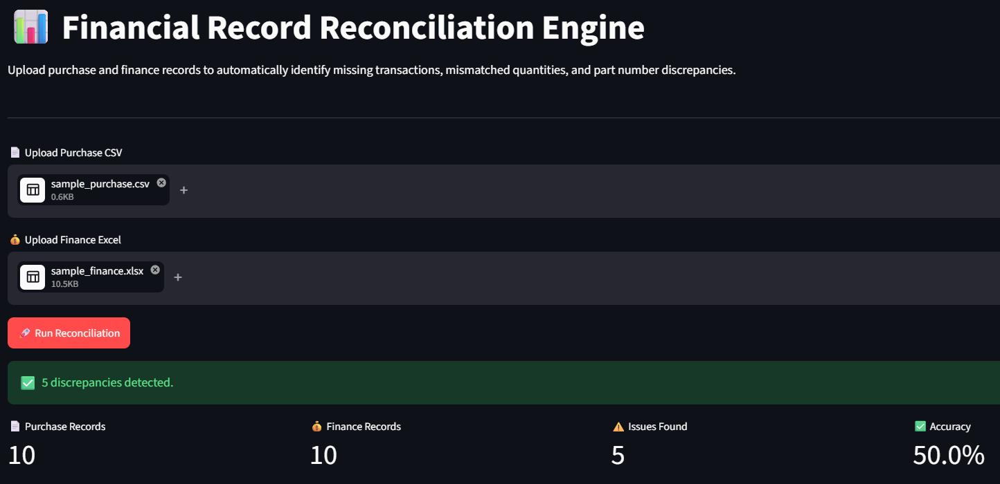
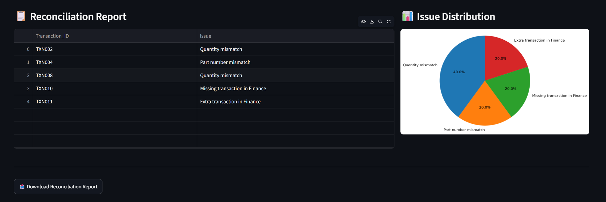

# Financial Record Reconciliation Engine

A Python-based reconciliation system that automates the comparison of purchase and finance records to identify discrepancies such as missing transactions, quantity mismatches, and part number inconsistencies. The application provides both a command-line workflow and an interactive Streamlit dashboard for reconciliation and reporting.

---

## Overview

Financial reconciliation is a critical process that ensures operational purchase records align with finance records for accurate reporting and auditing.

This project simulates an enterprise reconciliation workflow by automatically comparing two datasets and generating a detailed discrepancy report.

---

## Features

- Compare CSV and Excel datasets
- Detect missing transactions
- Detect extra transactions
- Identify quantity mismatches
- Identify part number mismatches
- Generate reconciliation reports
- Interactive Streamlit dashboard
- Download reconciliation results as CSV
- KPI dashboard with reconciliation metrics
- Issue distribution visualization

---

## Tech Stack

- Python
- Pandas
- Streamlit
- OpenPyXL
- Matplotlib

---

## Project Structure

```text
financial-record-reconciliation-engine
│
├── app/
│   └── app.py
│
├── config/
│   └── settings.py
│
├── data/
│
├── screenshots/
│
├── src/
│   ├── data_loader.py
│   ├── validator.py
│   ├── reconciler.py
│   ├── report_generator.py
│   └── main.py
│
├── requirements.txt
├── README.md
└── LICENSE
```

---

## Getting Started

Clone the repository

```bash
git clone https://github.com/sinci2573/financial-record-reconciliation-engine.git
cd financial-record-reconciliation-engine
```

Install dependencies

```bash
pip install -r requirements.txt
```

Run the application

```bash
streamlit run app/app.py
```

---

## Screenshots

### Dashboard


### Reconciliation Results


### Issue Distribution


---

## Example Output

| Transaction | Issue |
|-------------|------------------------------|
| TXN002 | Quantity mismatch |
| TXN004 | Part number mismatch |
| TXN008 | Quantity mismatch |
| TXN010 | Missing transaction in Finance |
| TXN011 | Extra transaction in Finance |

---

## Future Enhancements

- Support XLSB files
- Multi-sheet reconciliation
- Configurable validation rules
- PDF reconciliation reports
- REST API
- Docker deployment
- Authentication
- Audit history

---

## Disclaimer

This is a portfolio project inspired by enterprise financial reconciliation workflows. All datasets are synthetic and created solely for demonstration purposes. No proprietary or confidential business data is included.

---

## Dashboard

Upload purchase and finance records through an intuitive interface.



---

## Results Dashboard

View reconciliation metrics including record counts, detected issues, and reconciliation accuracy.



---

## Reconciliation Report & Analytics

Analyze detected discrepancies, visualize issue distribution, and download the generated reconciliation report.



## Author

**Sinchana Suresh Ganiga**

Software Development Engineer | AI/ML Enthusiast | Data Engineering